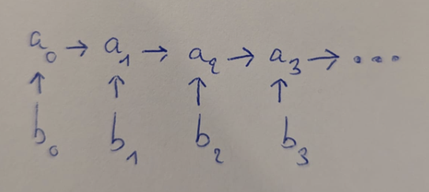
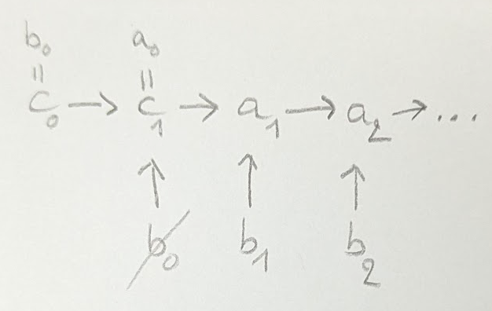
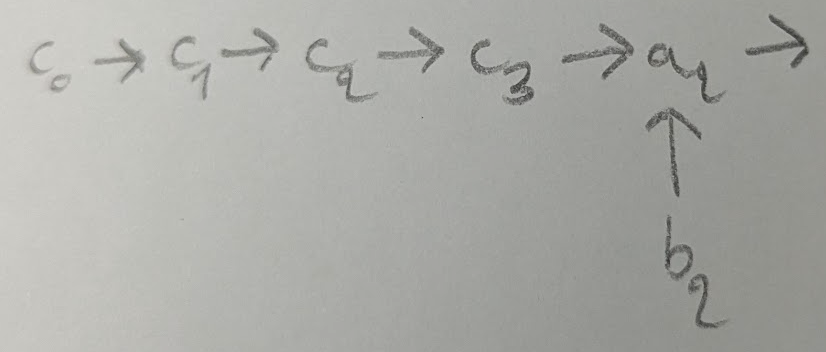
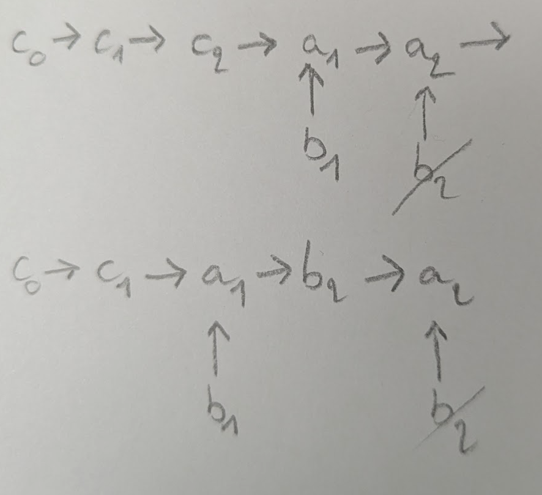

# comprendre le tri par fusion-insertion

j'avais fait une petite erreur de logique et c'était plus abstrait mais vous pouvez encore lire la première version plus bas 😉

---

on veut trier un tableau T

## étape 1 : parcourir T pour faire des paires ordonnées

on peut rester dans le même tableau et juste faire des swaps.

exemple :

T = 4, 2, 6, 3, 5

au premier niveau récursif, on peut voir T comme étant composé des paires suivantes : [4, 2], [6, 3], 5

et si on ordonne les paires de T, on obtient : 2, 4, 3, 6, 5

(on ordonne juste les éléments qui composent chaque paire, mais pas encore les paires entre elles.)

(on ne touche pas aux éléments solos à la fin de T.)

### définition

dans une paire donnée, on dit qu'on a (d'abord) un "petit" et (puis) un "grand". à ce stade, je les appelle aussi `b` pour le petit et `a` pour le grand.

### notation pour les schémas

pour deux nombres `a` et `b`, `b -> a` signifie que b < a.

## étape 2 : trier les paires par ordre croissant selon les grands

cela se fait par récurrence, selon le même algorithme. en ce sens, dans un niveau récursif plus profond, ce ne sera plus des nombres qu'il faudra trier mais des paires de nombres, des paires de paires de nombres, etc. pour l'instant, on va admettre que ça marche et qu'on est remonté au premier niveau récursif.

on va obtenir un tableau de nombres : [b0, a0, b1, a1, b2, a2, ...]

avec les relations d'ordre suivantes :



## étape 3 : initialiser a et b

`a` et `b` désignent maintenant deux nouveaux tableaux.

on initialise :
- a = [T[0], T[1], T[3], T[5], T[7], ...]
- b = [T[0], T[2], T[4], ...]

c'est à dire :
- a = [b0, a0, a1, a2, a3, a4, ...]
- b = [b0, b1, b2, ...]

`a` est forcément toujours trié. c'est là-dedans qu'on va construire notre résultat.

on a rajouté b0 au début de `a` pour gagner du temps sur l'étape suivante. à part ça, `a` fait la liste des grands et `b` fait la liste des petits.

exemple (issu de l'étape précédente) :

T = 2, 4, 3, 6, 5 

a = 2, 4, 6

b = 2, 3, 5

(si il restait un nombre qui n'est sont pas des paires, comme c'est un petit, il sera à la fin de b.)

## la recherche dichotomique

la dernière étape consiste à insérer le reste des éléments de `b` dans `a`. mais avant cela, il faut être à l'aise avec la recherche dichotomique.

le but d'une recherche dichotomique est de retrouver efficacement une valeur dans un tableau trié. à chaque étape, on compare la valeur recherchée à l'élément central du tableau et, si elle est <, on relance la recherche dans la moitié inférieure du tableau, sinon on relance dans la recherche dans la moitié supérieur du tableau. c'est un algorithme récursif. comme la taille du tableau est divisée par 2 à chaque étape, la complexité de cet algorithme est en O(log2(n)).

nous, on va utiliser la recherche dichotomique pour savoir à quel indice de `a` il faut insérer un élément de `b`. insérer à l'indice 0 veut dire qu'on insère au début du tableau, c'est à dire, après 0 élément. insérer à l'indice 1 veut dire qu'on insère après le premier élément, etc.

pour a = [a[0], a[1], a[2], a[3], ..., a[n - 1]], l'indice auquel il faut insérer un nombre `b` n'est autre que le nombre d'éléments de `a` qui sont inférieurs à `b`.

on pourrait parcourir `a` et compter le nombre d'éléments qui sont inférieurs à `b`, mais cela reviendrait à faire jusqu'à n comparaisons (dans le cas où `b` doit être inséré à la fin de `a`). avec une recherche dichotomique, on fera seulement log2(n) comparaisons maximum.

appelons cet algorithme `findI`. il prend en arguments :
- `a`
- `i`
- `j`
- `b`

`a[i:j]` désigne le sous-tableau de `a` des éléments compris entre les indices `i` (inclus) et `j` exclu.

```
cas de base : i == j
	on renvoie i car c'est l'indice recherché
cas de propagation
	on compare b à l'élément central de a[i:j]. appelons c l'indice de cet élément central.
	c = i + (j - i) / 2
	si b < a[c] on renvoie findI(a, i, c, b)
	si b > a[c] on renvoie findI(a, c + 1, j, b)
```

### exemple simple

a = [2, 9, 13, 21]

```
findI(a, 0, 4, 8)
	taille de a[0:4] = 4 - 0 = 4
	c = 0 + 4 / 2 = 2
	a[2] = 13
	8 < 13 donc on renvoie findI(a, 0, 2, 8)
		taille de a[0:2] = 2 - 0 = 2
		c = 0 + 2 / 2 = 1
		a[1] = 9
		8 < 9 donc on renvoie findI(a, 0, 1, 8)
			taille de a[0:1] = 1
			c = 0 + 1 / 2 = 0
			a[0] = 2
			8 > 2 donc on renvoie findI(a, 1, 1, 8)
					cas de base donc on renvoie 1

findI(a, 0, 4, 10)
	taille de a[0:4] = 4
	c = 2
	a[2] = 13
	10 < 13 donc on renvoie findI(a, 0, 2, 10)
		taille de a[0:2] = 2
		c = 0 + 2 / 2 = 1
		a[1] = 9
		10 > 9 donc on renvoie findI(a, 2, 2, 10)
			cas de base donc on renvoie 2
```

## le nombre de comparaisons d'une recherche dichotomique

on cherche le nombre de comparaisons maximales nécessaires pour insérer une valeur dans un tableau trié de n éléments. appelons ça cmp(n).

n | cmp(n)
-- | --
2 | 2
3 | 2
4 | 3
5 | 3
6 | 3
7 | 3
8 | 4
9 | 4
10 | 4
11 | 4
12 | 4
13 | 4
14 | 4
15 | 4
16 | 5
17 | 5
... | ...

on remarque que cmp(n) change à chaque puissance de 2.

on trouve que `cmp(n) = floor ( log2 (n) ) + 1`.

## étape 4

on va insérer le reste des éléments de `b` dans `a`.

appelons `c` les éléments indifférenciés de `a` qui serviront à effectuer la prochaine recherche dichotomique. c'est le sous-tableau des `l` premiers éléments de `a`.

comme on a déjà inséré b0 à l'étape 3, on a :



### si on insère d'abord b1 puis b2

on sait déjà que b1 sera inséré avant a1 donc on peut restreindre la recherche dichotomique à c = [b0, a0].

on a :
- l = 2
- cmp(2) = 2

on insère b1 dans `a` et on obtient, au moment d'insérer b2 :



(`c` contient maintenant b1 et a1.)

donc, pour insérer b2, on a :
- l = 4
- cmp(4) = 3

### si on insère b2 puis b1

on cherche où insérer b2 dans [b0, a0, a1], donc on a :
- l = 3
- cmp(3) = 2

on obtient l'un de ces cas :



dans tous les cas, on pourra insérer b1 en gardant l = 3. on pourrait même utiliser l = 2 dans le deuxième cas mais on va pas se compliquer trop les choses.

ainsi, insérer b2 puis b1 a permis de conserver la même valeur (minimale) de cmp.

---

sur ce même principe, le but sera d'insérer tous les `b` par série de même cmp. une série permet d'insérer au plus `z` éléments. `z` est la taille de la série.

j'appelle la première série S0, puis S1, S2, S3, …

S0 a été réalisé à l'étape 3 en insérant b0 (elle était de taille 1).

S1 consiste à insérer b2 puis b1 (donc elle est de taille 2).

toute série consistera à insérer un premier élément de `b` dans le sous-tableau des `x` premiers éléments de `a`, puis le `b` d'indice précédent, puis son précédent, etc, en gardant toujours le même `x` pour cmp et jusqu'à ce qu'on retombe sur un `b` ayant déjà été inséré.

il apparait que `l` augmente d'une série à l'autre d'exactement 2 * `z`.

on utilise la suite de jacobsthal, notée `J`, pour savoir à quel indice de `b` il faut commencer une série.

cette suite est définie par :

```
J(0) = 0
J(1) = 1
J(n) = J(n - 1) + 2 * J(n - 2)
```

d'où :

n | J(n)
-- | --
0 | 0
1 | 1
2 | 1
3 | 3
4 | 5
5 | 11
6 | 21
7 | 43
8 | 85
... | ...

pour la série `Sn`, il faudra commencer par insérer l'élément de `b` d'indice `J(n + 2) - 1`.

la taille de la série `Sn` est `J(n + 2) - J(n + 1)`.

série | n | J(n) | éléments insérés
-- | -- | -- | --
S0 | 2 | 1 | b[0]
S1 | 3 | 3 | b[2], b[1]
S2 | 4 | 5 | b[4], b[3]
S3 | 5 | 11 | b[10], b[9], b[8], b[7], b[6], b[5]
S4 | 6 | 21 | b[20], b[19], b[18], b[17], b[16], b[15], b[14], b[13], b[12], b[11]
… | … | … | …

## récap

série | `l` | `j` | `z` | `ll`
-- | -- | -- | -- | --
  | | | 1 | | 
0 | 0 | 1 | 1 | 0 + 1 - 1 = 0
1 | 0 + 2 * 1 = 2 | 1 + 2 * 1 = 3 | 3 - 1 = 2 | 2 + 2 - 1 = 3
2 | 2 + 2 * 2 = 6 | 3 + 2 * 1 = 5 | 5 - 3 = 2 | 6 + 2 - 1 = 7
3 | 6 + 2 * 2 = 10 | 5 + 2 * 3 = 11 | 11 - 5 = 6 | 10 + 6 - 1 = 15
4 | 10 + 2 * 6 = 22 | 11 + 2 * 5 = 21 | 21 - 11 = 10 | 22 + 10 - 1 = 31
… | … | … | … | …

### bilan

```
l = lp + 2 * zp (= j + 1)
j = jp + 2 * jpp
z = j - jp = lp
ll = l + z - 1
```

### notations

- `l` : longueur de `c` au début d'une série d'insertion
- `lp` : `l` précédent
- `j` : nombre de jacobsthal courant
- `jp` : `j` précédent
- `jpp` : `jp` précédent
- `z` : la taille de la série
- `zp` : `z` précédent
- `ll` : taille de `a` à utiliser pour faire les recherches dichotomiques au cours de la série

# notes pour les récursions

à chaque appel récursif, on lance l'algorithme sur un tableau en précisant la taille de son élément unitaire et indivisible. appelons cette taille `n`.

au début, on lance l'algorithme avec n = 1. un élément a donc une taille de 1, c'est à dire que c'est un unique nombre.

au début de l'étape 2, il faut relancer l'algorithme en doublant `n`. ainsi, au deuxième niveau récursif, un élément unitaire sera composé de 2 nombres. les nombres qui composent un élément sont inséparables, ils bougent tous ensemble à chaque fois.

ainsi, pour itérer sur les éléments d'un tableau, il faut avancer de `n` cases à chaque fois. et pour un élément d'indice `iE`, la valeur qu'il faut utiliser pour le tri (que j'appelle la valeur de tête) se situe à `iE + n - 1` (c'est la valeur du grand, donc elle est à la fin de l'élément).

un niveau récursif s'occupe de trier tous les éléments qui composent le début du tableau, qu'ils soient tous appairés ou qu'il y en ait un en plus qui ira dans `b` et qui sera inséré aussi. par contre, tout ce qui n'a pas assez de nombres pour former un élément doit rester tel quel à la fin du tableau !

exemple avec 6 nombres (éléments entourés et flèche sur la valeur de tête) :


# ancienne version

on veut trier un tableau de n nombres.

algorithme en 5 étapes.

**étape 1** : faire des paires d'éléments.

**étape 2** : ordonner les 2 éléments qui composent chaque paire.

on dit que l'élément le plus grand d'une paire donnée est de type `a`, et l'autre est de type `b`.

la notation `b -> a` signifie b < a. dans la paire d'indice `n`, on a donc : `b_n -> a_n`.

**étape 3** : trier les paires par ordre croissant selon les éléments de type `a`.

cela se fait par récurrence, selon le même algorithme. on va obtenir :


**étape 4** : initialiser l'insertion.

on dit qu'un élément de type `a` ou `b` devient de type `c` lorsqu'il est inséré dans la liste finale. la liste des `c` en question est donc triée à tout moment et se situe avant les paires (voir sur les schémas).

l'algorithme consiste à faire des série d'insertions d'éléments de type `b` dans la liste finale, ce qui au passage va aussi insérer les éléments de type `a` qui leur sont associés.

pour cette première série d'insertion, rien ne va changer à part la notation. en effet, on veut juste insérer `b1` (et, de ce fait, le `a1` qui lui est associé). or, `b1` est déjà bien placé, donc on ne fait rien.

on remarque que, pour insérer un élément dans cette liste vide de `c`, 0 comparaisons sont nécessaires.

on obtient les 2 premiers `c`, qui sont les anciens `b1` et `a1` :


**étape 5** : continuer les séries d'insertions.

le nombre d'éléments de type `c` détermine la prochaine série d'insertions. en effet, il ne faut pas juste insérer les `b` dans l'ordre des paires. petit exemple pour comprendre pourquoi :

## si on insère b2 puis b3

### pour b2

on veut insérer `b2` dans un tableau trié [`c1`, `c2`]. ça va nous couter au plus 2 comparaisons (une avec `c2`, et, si on a pas de chance, une autre avec `c1`). (voir annexe pour un rappel sur la recherche dichotomique).

on se retrouve avec une configuration :


### pour b3

on veut insérer `b3` dans un tableau trié [`c1`, `c2`, `c3`, `c4`].

comme on trie par dichotomie, on sait que ça va nous coûter au plus 3 comparaisons (une avec `c3`, une autre avec `c2` ou `c4`, et potentiellement, une 3e avec `c1`).

au final, si on insère `b2` avant `b3`, ça nous coûte, au pire, **5** comparaisons.

## si on insère b3 puis b2


on veut insérer `b3` dans un tableau trié [`c1`, `c2`]. donc, comme on l'a vu juste avant, ça va nous coûter, au plus, 2 comparaisons.

et là, miracle, lorsqu'on va vouloir insérer `b2`, on sera dans cette configuration :


donc on va vouloir insérer `b2` dans un tableau trié [`c1`, `c2`, `c3`], ce qui ne coûte toujours que 2 comparaisons, et non 3 (une avec `c2`, et une autre avec `c1` ou `c3`).

donc, si on insère `b3` avant `b2`, ça nous coûte, au pire, **4** comparaisons. c'est mieux que si on insère `b2` avant `b3` et ce serait encore plus marquant pour de grandes tailles de `c`.

## les prochaines séries d'insertion

la 2e série d'insertion a donc permis d'insérer 2 éléments de type `b` dans la liste finale (et automatiquement les 2 éléments de type `a` qui leur étaient associés), en utilisant, pour chaque insertion, le même nombre maximal de comparaisons.

on se retrouve dans cette configuration :


quel élément faut-il insérer ensuite ? encore une fois, cela dépend de la taille de `c`.

pour une taille de 6, il faut d'abord insérer `b5`, puis `b4`. ainsi, on aura, pour l'une et l'autre insertion, seulement 3 comparaisons maximum à faire.

une fois `b4` et `b5` insérés, on est dans la configuration :


(changer `d` en `c`)

là, pour une taille de `c` de 10, la prochaine série consiste à insérer `b11`, puis `b10`, `b9`, `b8`, `b7`, et `b6` (et donc automatique les éléments de type `a` qui leur sont associés). ainsi, on aura, pour toutes ces insertions, au plus 4 comparaisons à faire.

on peut préciser maintenant ce qu'on étend par série d'insertion d'indice `k` : c'est le fait d'insérer tous les éléments de type `b` qui sont d'indice `k` ou moins, du plus grand au plus petit.

à ce stade on a donc réalisé les 4 premières séries d'insertions, d'indices : 1, 3, 5 et 11.

## comprendre et trouver les indices des séries d'insertions

pour trouver l'indice d'une nouvelle série, sachant celle de la précédente, il faut qu'on trouve sa taille, c'est a dire, le nombre d'éléments de type `b` qui vont être insérés au cours de la série. en effet, l'indice d'une série c'est l'indice de la précédente série + la taille de la nouvelle série.

### nombre de comparaisons d'une recherche dichotomique

on cherche le nombre de comparaisons maximales nécessaires pour insérer une valeur `b` dans un tableau trié de n éléments. appelons ça cmp(n).

petit récap de ce qu'on a vu + généralisation :

n | cmp(n)
-- | --
2 | 2
3 | 2
4 | 3
5 | 3
6 | 3
7 | 3
8 | 4
9 | 4
10 | 4
11 | 4
12 | 4
13 | 4
14 | 4
15 | 4
16 | 5
17 | 5
... | ...

on remarque que cmp(n) change à chaque puissance de 2.

on trouve que `cmp(n) = floor ( log2 (n) ) + 1`.

### trouver la taille d'une série pour n donné

pour une liste de `c` de taille `n` donnée, on sait que toutes les insertions de la prochaine série utiliseront des recherches dichotomiques à `cmp(n)` comparaisons maximum. la question revient donc à trouver le nombre de valeurs supérieurs ou égales à `n` qui donnent ce même `cmp(n)`.

par exemple, au début de l'étape 5, on avait n = 2. cmp(2) = 2 et, dans le tableau, on voit bien que cmp(n) reste à 2 jusqu'à la prochaine puissance de 2, qui est 4. c'est ce qui explique que la taille de la prochaine série devait être de 4 - 2 = 2.

on avait ensuite n = 6 car on a inséré 2 éléments de type `b` et 2 éléments de type `a` dans une liste de taille `2`. cmp(6) = 3 et cmp(n) reste à 3 jusqu'à ce que n = 8. 8 - 6 = 2 donc on a encore eu une série de taille 2.

ensuite, on avait n = 10 (= 6 + 2 * 2), cmp(n) = 4 jusqu'à ce que n = 16. 16 - 10 = 6 et c'est pourquoi on avait une série de taille 6.

### trouver l'indice d'une série sachant l'indice précédent et la taille

k | 2^k | taille de c | taille de la série | indice du premier b à insérer
--  | -- | -- | -- | --
1 | 2 | 0 | 1 | 1
2 | 4 | 0 + 2 * 1 = 2 | 4 - 2 = 2 | 1 + 2 = 3
3 | 8 | 2 + 2 * 2 = 6 | 8 - 6 = 2 | 3 + 2 = 5
4 | 16 | 6 + 2 * 2 = 10 | 16 - 10 = 6 | 5 + 6 = 11
5 | 32 | 10 + 2 * 6 = 22 | 32 - 22 = 10 | 11 + 10 = 21
6 | 64 | 22 + 2 * 10 = 42 | 64 - 42 = 22 | 21 + 22 = 43
... | ... | ... | ...

remarques :

taille de c = 2 * indice précédent

taille de la série = 2 * indice précédent précédent

### la suite de jacobsthal

on peut remarquer que les indices suivent la suite de jacobsthal :

J_n = J_(n - 1) + 2 * J_(n - 2)

donc on pourra directement utiliser cette propriété.
