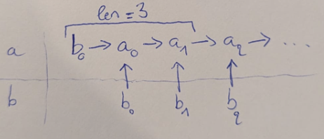
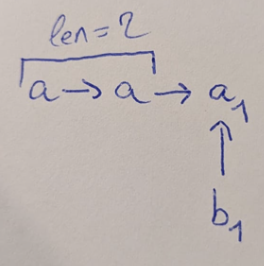
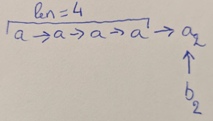
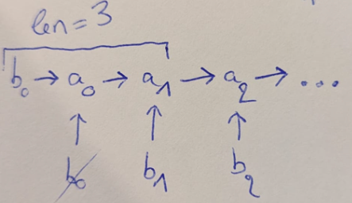
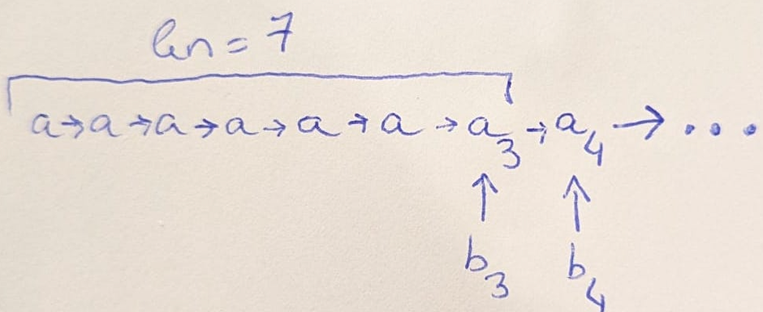

# comprendre le tri par fusion-insertion

ceci est une section en travaux car j'ai fait une petite erreur de logique :/

voir la version précédente plus bas !

---

on veut trier un tableau T

## étape 1 : parcourir T pour faire des paires ordonnées

on peut rester dans le même tableau et juste faire des swaps.

exemple :

T = 4, 2, 6, 3, 5

on peut voir T comme étant composé des paires suivantes : [4, 2], [6, 3], 5

et si on ordonne les paires de T, on obtient : 2, 4, 3, 6, 5

(on ne touche pas aux éléments solos à la fin de T)

### définition

dans une paire donnée, on dit qu'on a (d'abord) un "petit" et (puis) un "grand". à ce stade, je les appelle aussi `b` pour le petit et `a` pour le grand.

### notation

`i -> j` signifie que i < j.

donc, pour la paire d'indice i, on a : `b_i -> a_i`

## étape 2 : trier les paires par ordre croissant selon les grands

cela se fait par récurrence, selon le même algorithme. on y reviendra mais pour l'instant on va admettre que ça marche.

on va obtenir un tableau : [b0, a0, b1, a1, b2, a2, ...]

avec :


## étape 3 : initialiser a et b

`a` et `b` désignent maintenant deux nouveaux tableaux.

on initialise :
- a = [T[0], T[1], T[3], T[5], T[7], ...]
- b = [T[0], T[2], T[4], ...]

c'est à dire :
- a = [b0, a1, a2, a3, a4, ...]
- b = [b0, b1, b2, ...]

`a` est forcément toujours trié. c'est là-dedans qu'on va construire notre résultat.

on a rajouté b0 au début de `a` pour gagner du temps.

`b` fait la liste des petits. on va juste y accéder en lecture.

exemple (issu de l'étape précédente) :

T = 2, 4, 3, 6, 5 

a = 2, 4, 6

b = 2, 3, 5

(si il reste un nombre solo on le met dans b)

## étape 4 : insérer le reste des éléments de b dans a

on va faire des séries d'insertion d'éléments de b dans a.

### définition

la taille d'une série c'est le nombre maximal d'éléments de b qui sont insérés au cours de la série.

`a` possède une taille courante que je vais noter `len` et qui est différente de son nombre d'éléments. c'est une taille qui dépendra uniquement de la série d'insertion. on y reviendra.

la première série d'insertion est S0, puis S1, S2, S3, ...

S0 a déjà été réalisé à l'étape 3 lorsqu'on a inséré b0 au début de `a`. c'était une série de taille 1.

donc on commence à S1 avec `len = 3` (on verra comment trouver `len` exactement plus tard).

situation :



en fait, on devra souvent raisonner sur les `len` premiers éléments de `a`, peu importe qu'ils proviennent de `a` ou de `b`. perso, je vais juste les appeler `a`.

à chaque série, il faudra garder en mémoire l'indice du dernier `b` ayant été inséré.

### comprendre le déroulement d'une série d'insertion

il ne faut pas juste insérer les `b` dans l'ordre. c'est pourquoi il y a des séries avec des tailles bien précises. petit exemple pour comprendre pourquoi :

#### si on insère b1 puis b2

la prochaine série, S1, est de taille 2. mais il faut absolument insérer b2 avant b1. voici pourquoi.

(il faut absolument être à l'aise en recherche dichotomique pour comprendre cette partie. voir l'annexe ci-dessous si ce n'est pas le cas.)

on a un truc comme ça :



insérer b1 dans le tableau des 2 premiers éléments de `a`, coûte au plus 2 comparaisons.

on obtient un truc comme ça :



insérer b2 dans le tableau des 4 premiers éléments de `a`, coûte au plus 3 comparaisons.

#### si on insère b2 puis b1

on était dans un truc comme ça :



insérer b2 dans le tableau des 3 premiers éléments de `a` coûte au plus 2 comparaisons.

selon l'endroit où b2 a été inséré, on se retrouvera dans un de ces cas pour insérer b1 :


on remarque que, dans l'un ou l'autre cas, cela ne coûte toujours au plus que 2 comparaisons pour insérer b1. ce résultat serait d'autant plus marquant pour de grandes valeurs de `len`.

pour ne pas s'embêter, on peut garder le même `len` pour toute une série d'insertion

---

finalement, pour S1, on a vu qu'il fallait insérer b2 puis b1 avec len = 3. on mémorise l'indice du dernier b inséré (c'est 2) et on passe le len à 7.

on obtient :



### S2

il faut d'abord insérer b4 dans le tableau des 7 premiers éléments de `a`. ça coûte 3 comparaisons maximum. ensuite, on peut faire pareil pour b3, avec toujours 3 comparaisons max.

### 


la 2e série d'insertion a donc permis d'insérer 2 éléments de type `b` dans la liste finale (et automatiquement les 2 éléments de type `a` qui leur étaient associés), en utilisant, pour chaque insertion, le même nombre maximal de comparaisons.

on se retrouve dans cette configuration :


quel élément faut-il insérer ensuite ? encore une fois, cela dépend de la taille de `c`.

pour une taille de 6, il faut d'abord insérer `b5`, puis `b4`. ainsi, on aura, pour l'une et l'autre insertion, seulement 3 comparaisons maximum à faire.

une fois `b4` et `b5` insérés, on est dans la configuration :


(changer `d` en `c`)

là, pour une taille de `c` de 10, la prochaine série consiste à insérer `b11`, puis `b10`, `b9`, `b8`, `b7`, et `b6` (et donc automatique les éléments de type `a` qui leur sont associés). ainsi, on aura, pour toutes ces insertions, au plus 4 comparaisons à faire.

on peut préciser maintenant ce qu'on étend par série d'insertion d'indice `k` : c'est le fait d'insérer tous les éléments de type `b` qui sont d'indice `k` ou moins, du plus grand au plus petit.

à ce stade on a donc réalisé les 4 premières séries d'insertions, d'indices : 1, 3, 5 et 11.

## comprendre et trouver les indices des séries d'insertions

pour trouver l'indice d'une nouvelle série, sachant celle de la précédente, il faut qu'on trouve sa taille, c'est a dire, le nombre d'éléments de type `b` qui vont être insérés au cours de la série. en effet, l'indice d'une série c'est l'indice de la précédente série + la taille de la nouvelle série.

### nombre de comparaisons d'une recherche dichotomique

on cherche le nombre de comparaisons maximales nécessaires pour insérer une valeur `b` dans un tableau trié de n éléments. appelons ça cmp(n).

petit récap de ce qu'on a vu + généralisation :

n | cmp(n)
-- | --
2 | 2
3 | 2
4 | 3
5 | 3
6 | 3
7 | 3
8 | 4
9 | 4
10 | 4
11 | 4
12 | 4
13 | 4
14 | 4
15 | 4
16 | 5
17 | 5
... | ...

on remarque que cmp(n) change à chaque puissance de 2.

on trouve que `cmp(n) = floor ( log2 (n) ) + 1`.

### trouver la taille d'une série pour n donné

pour une liste de `c` de taille `n` donnée, on sait que toutes les insertions de la prochaine série utiliseront des recherches dichotomiques à `cmp(n)` comparaisons maximum. la question revient donc à trouver le nombre de valeurs supérieurs ou égales à `n` qui donnent ce même `cmp(n)`.

par exemple, au début de l'étape 5, on avait n = 2. cmp(2) = 2 et, dans le tableau, on voit bien que cmp(n) reste à 2 jusqu'à la prochaine puissance de 2, qui est 4. c'est ce qui explique que la taille de la prochaine série devait être de 4 - 2 = 2.

on avait ensuite n = 6 car on a inséré 2 éléments de type `b` et 2 éléments de type `a` dans une liste de taille `2`. cmp(6) = 3 et cmp(n) reste à 3 jusqu'à ce que n = 8. 8 - 6 = 2 donc on a encore eu une série de taille 2.

ensuite, on avait n = 10 (= 6 + 2 * 2), cmp(n) = 4 jusqu'à ce que n = 16. 16 - 10 = 6 et c'est pourquoi on avait une série de taille 6.

### trouver l'indice d'une série sachant l'indice précédent et la taille

k | 2^k | taille de c | taille de la série | indice du premier b à insérer
--  | -- | -- | -- | --
1 | 2 | 0 | 1 | 1
2 | 4 | 0 + 2 * 1 = 2 | 4 - 2 = 2 | 1 + 2 = 3
3 | 8 | 2 + 2 * 2 = 6 | 8 - 6 = 2 | 3 + 2 = 5
4 | 16 | 6 + 2 * 2 = 10 | 16 - 10 = 6 | 5 + 6 = 11
5 | 32 | 10 + 2 * 6 = 22 | 32 - 22 = 10 | 11 + 10 = 21
6 | 64 | 22 + 2 * 10 = 42 | 64 - 42 = 22 | 21 + 22 = 43
... | ... | ... | ...

remarques :

taille de c = 2 * indice précédent

taille de la série = 2 * indice précédent précédent

### la suite de jacobsthal

on peut remarquer que les indices suivent la suite de jacobsthal :

J_n = J_(n - 1) + 2 * J_(n - 2)

donc on pourra directement utiliser cette propriété.

# annexe : trouver l'indice d'insertion grâce à la recherche dichotomique

(lire https://fr.wikipedia.org/wiki/Recherche_dichotomique avant, pour comprendre le principe d'une recherche dichotomique.)

soit `T` = [`T[0]`, `T[1]`, `T[2]`, ..., `T[n - 1]`], un tableau **trié** de n nombres.

on veut insérer un nombre `b` dans T. pour cela, on veut savoir l'indice de `T` auquel insérer `b`.

il se trouve que cet indice n'est autre que le nombre d'éléments de `T` qui sont inférieurs à `b`.

on pourrait parcourir `T` et compter le nombre d'éléments qui sont inférieurs à `b`, mais cela reviendrait à faire jusqu'à n comparaisons si `b` doit être inséré à la fin de `T`, par exemple.

on peux faire mieux avec la recherche dichotomique, car `T` est trié, réduisant à log2(n) le nombre maximal de comparaisons.

c'est un algorithme récursif. appelons-le `recherche_indice`. il prend en argument le sous tableau de `T` des éléments compris entre les indices `i` (inclus) et `j` exclu, que je vais noter `T[i:j]`, et notre élément `b`.

- cas de base : `T[i:j]` est vide car `i == j`.
  - on peut renvoyer `i`, c'est l'indice auquel il faut insérer `b`
- pour un sous tableau `T[i:j]` de taille `j - i` > 0, on compare `b` à l'élément central de `T[i:j]`. appelons `c` l'indice de cet élément central. on l'obtient en faisant : `i + (j - i) / 2`.
  - si `b` < `T[c]`, on renvoie `recherche_indice(T[i:c], b)` 
  - si `b` > `T[c]`, on renvoie `recherche_indice(T[(c + 1):j], b)`

## exemple simple

T = [2, 9, 13, 21]

```
recherche_indice(T[0:4], 8)
	taille de T[0:4] = 4 - 0 = 4
	c = 0 + 4 / 2 = 2
	T[2] = 13
	8 < 13 donc on renvoie recherche_indice(T[0:2], 8)
	recherche_indice(T[0:2], 8)
		taille de T[0:2] = 2 - 0 = 2
		c = 0 + 2 / 2 = 1
		T[1] = 9
		8 < 9 donc on renvoie recherche_indice(T[0:1], 8)
		recherche_indice(T[0:1], 8)
			taille de T[0:1] = 1
			c = 0 + 1 / 2 = 0
			T[0] = 2
			8 > 2 donc on renvoie recherche_indice(T[1:1], 8)
				recherche_indice(T[1:1], 8)
					cas de base
					on renvoie 1

recherche_indice(T[0:4], 10)
	taille de T[0:4] = 4
	c = 2
	T[2] = 13
	10 < 13 donc on renvoie recherche_indice(T[0:2], 10)
	recherche_indice(T[0:2], 10)
		taille de T[0:2] = 2
		c = 0 + 2 / 2 = 1
		T[1] = 9
		10 > 9 donc on renvoie recherche_indice(T[2:2], 10)
			cas de base
			on renvoie 2
```


# ancienne version

on veut trier un tableau de n nombres.

algorithme en 5 étapes.

**étape 1** : faire des paires d'éléments.

**étape 2** : ordonner les 2 éléments qui composent chaque paire.

on dit que l'élément le plus grand d'une paire donnée est de type `a`, et l'autre est de type `b`.

la notation `b -> a` signifie b < a. dans la paire d'indice `n`, on a donc : `b_n -> a_n`.

**étape 3** : trier les paires par ordre croissant selon les éléments de type `a`.

cela se fait par récurrence, selon le même algorithme. on va obtenir :


**étape 4** : initialiser l'insertion.

on dit qu'un élément de type `a` ou `b` devient de type `c` lorsqu'il est inséré dans la liste finale. la liste des `c` en question est donc triée à tout moment et se situe avant les paires (voir sur les schémas).

l'algorithme consiste à faire des série d'insertions d'éléments de type `b` dans la liste finale, ce qui au passage va aussi insérer les éléments de type `a` qui leur sont associés.

pour cette première série d'insertion, rien ne va changer à part la notation. en effet, on veut juste insérer `b1` (et, de ce fait, le `a1` qui lui est associé). or, `b1` est déjà bien placé, donc on ne fait rien.

on remarque que, pour insérer un élément dans cette liste vide de `c`, 0 comparaisons sont nécessaires.

on obtient les 2 premiers `c`, qui sont les anciens `b1` et `a1` :


**étape 5** : continuer les séries d'insertions.

le nombre d'éléments de type `c` détermine la prochaine série d'insertions. en effet, il ne faut pas juste insérer les `b` dans l'ordre des paires. petit exemple pour comprendre pourquoi :

## si on insère b2 puis b3

### pour b2

on veut insérer `b2` dans un tableau trié [`c1`, `c2`]. ça va nous couter au plus 2 comparaisons (une avec `c2`, et, si on a pas de chance, une autre avec `c1`). (voir annexe pour un rappel sur la recherche dichotomique).

on se retrouve avec une configuration :


### pour b3

on veut insérer `b3` dans un tableau trié [`c1`, `c2`, `c3`, `c4`].

comme on trie par dichotomie, on sait que ça va nous coûter au plus 3 comparaisons (une avec `c3`, une autre avec `c2` ou `c4`, et potentiellement, une 3e avec `c1`).

au final, si on insère `b2` avant `b3`, ça nous coûte, au pire, **5** comparaisons.

## si on insère b3 puis b2


on veut insérer `b3` dans un tableau trié [`c1`, `c2`]. donc, comme on l'a vu juste avant, ça va nous coûter, au plus, 2 comparaisons.

et là, miracle, lorsqu'on va vouloir insérer `b2`, on sera dans cette configuration :


donc on va vouloir insérer `b2` dans un tableau trié [`c1`, `c2`, `c3`], ce qui ne coûte toujours que 2 comparaisons, et non 3 (une avec `c2`, et une autre avec `c1` ou `c3`).

donc, si on insère `b3` avant `b2`, ça nous coûte, au pire, **4** comparaisons. c'est mieux que si on insère `b2` avant `b3` et ce serait encore plus marquant pour de grandes tailles de `c`.

## les prochaines séries d'insertion

la 2e série d'insertion a donc permis d'insérer 2 éléments de type `b` dans la liste finale (et automatiquement les 2 éléments de type `a` qui leur étaient associés), en utilisant, pour chaque insertion, le même nombre maximal de comparaisons.

on se retrouve dans cette configuration :


quel élément faut-il insérer ensuite ? encore une fois, cela dépend de la taille de `c`.

pour une taille de 6, il faut d'abord insérer `b5`, puis `b4`. ainsi, on aura, pour l'une et l'autre insertion, seulement 3 comparaisons maximum à faire.

une fois `b4` et `b5` insérés, on est dans la configuration :


(changer `d` en `c`)

là, pour une taille de `c` de 10, la prochaine série consiste à insérer `b11`, puis `b10`, `b9`, `b8`, `b7`, et `b6` (et donc automatique les éléments de type `a` qui leur sont associés). ainsi, on aura, pour toutes ces insertions, au plus 4 comparaisons à faire.

on peut préciser maintenant ce qu'on étend par série d'insertion d'indice `k` : c'est le fait d'insérer tous les éléments de type `b` qui sont d'indice `k` ou moins, du plus grand au plus petit.

à ce stade on a donc réalisé les 4 premières séries d'insertions, d'indices : 1, 3, 5 et 11.

## comprendre et trouver les indices des séries d'insertions

pour trouver l'indice d'une nouvelle série, sachant celle de la précédente, il faut qu'on trouve sa taille, c'est a dire, le nombre d'éléments de type `b` qui vont être insérés au cours de la série. en effet, l'indice d'une série c'est l'indice de la précédente série + la taille de la nouvelle série.

### nombre de comparaisons d'une recherche dichotomique

on cherche le nombre de comparaisons maximales nécessaires pour insérer une valeur `b` dans un tableau trié de n éléments. appelons ça cmp(n).

petit récap de ce qu'on a vu + généralisation :

n | cmp(n)
-- | --
2 | 2
3 | 2
4 | 3
5 | 3
6 | 3
7 | 3
8 | 4
9 | 4
10 | 4
11 | 4
12 | 4
13 | 4
14 | 4
15 | 4
16 | 5
17 | 5
... | ...

on remarque que cmp(n) change à chaque puissance de 2.

on trouve que `cmp(n) = floor ( log2 (n) ) + 1`.

### trouver la taille d'une série pour n donné

pour une liste de `c` de taille `n` donnée, on sait que toutes les insertions de la prochaine série utiliseront des recherches dichotomiques à `cmp(n)` comparaisons maximum. la question revient donc à trouver le nombre de valeurs supérieurs ou égales à `n` qui donnent ce même `cmp(n)`.

par exemple, au début de l'étape 5, on avait n = 2. cmp(2) = 2 et, dans le tableau, on voit bien que cmp(n) reste à 2 jusqu'à la prochaine puissance de 2, qui est 4. c'est ce qui explique que la taille de la prochaine série devait être de 4 - 2 = 2.

on avait ensuite n = 6 car on a inséré 2 éléments de type `b` et 2 éléments de type `a` dans une liste de taille `2`. cmp(6) = 3 et cmp(n) reste à 3 jusqu'à ce que n = 8. 8 - 6 = 2 donc on a encore eu une série de taille 2.

ensuite, on avait n = 10 (= 6 + 2 * 2), cmp(n) = 4 jusqu'à ce que n = 16. 16 - 10 = 6 et c'est pourquoi on avait une série de taille 6.

### trouver l'indice d'une série sachant l'indice précédent et la taille

k | 2^k | taille de c | taille de la série | indice du premier b à insérer
--  | -- | -- | -- | --
1 | 2 | 0 | 1 | 1
2 | 4 | 0 + 2 * 1 = 2 | 4 - 2 = 2 | 1 + 2 = 3
3 | 8 | 2 + 2 * 2 = 6 | 8 - 6 = 2 | 3 + 2 = 5
4 | 16 | 6 + 2 * 2 = 10 | 16 - 10 = 6 | 5 + 6 = 11
5 | 32 | 10 + 2 * 6 = 22 | 32 - 22 = 10 | 11 + 10 = 21
6 | 64 | 22 + 2 * 10 = 42 | 64 - 42 = 22 | 21 + 22 = 43
... | ... | ... | ...

remarques :

taille de c = 2 * indice précédent

taille de la série = 2 * indice précédent précédent

### la suite de jacobsthal

on peut remarquer que les indices suivent la suite de jacobsthal :

J_n = J_(n - 1) + 2 * J_(n - 2)

donc on pourra directement utiliser cette propriété.

# annexe : trouver l'indice d'insertion grâce à la recherche dichotomique

(lire https://fr.wikipedia.org/wiki/Recherche_dichotomique avant, pour comprendre le principe d'une recherche dichotomique.)

soit `T` = [`T[0]`, `T[1]`, `T[2]`, ..., `T[n - 1]`], un tableau **trié** de n nombres.

on veut insérer un nombre `b` dans T. pour cela, on veut savoir l'indice de `T` auquel insérer `b`.

il se trouve que cet indice n'est autre que le nombre d'éléments de `T` qui sont inférieurs à `b`.

on pourrait parcourir `T` et compter le nombre d'éléments qui sont inférieurs à `b`, mais cela reviendrait à faire jusqu'à n comparaisons si `b` doit être inséré à la fin de `T`, par exemple.

on peux faire mieux avec la recherche dichotomique, car `T` est trié, réduisant à log2(n) le nombre maximal de comparaisons.

c'est un algorithme récursif. appelons-le `recherche_indice`. il prend en argument le sous tableau de `T` des éléments compris entre les indices `i` (inclus) et `j` exclu, que je vais noter `T[i:j]`, et notre élément `b`.

- cas de base : `T[i:j]` est vide car `i == j`.
  - on peut renvoyer `i`, c'est l'indice auquel il faut insérer `b`
- pour un sous tableau `T[i:j]` de taille `j - i` > 0, on compare `b` à l'élément central de `T[i:j]`. appelons `c` l'indice de cet élément central. on l'obtient en faisant : `i + (j - i) / 2`.
  - si `b` < `T[c]`, on renvoie `recherche_indice(T[i:c], b)` 
  - si `b` > `T[c]`, on renvoie `recherche_indice(T[(c + 1):j], b)`

## exemple simple

T = [2, 9, 13, 21]

```
recherche_indice(T[0:4], 8)
	taille de T[0:4] = 4 - 0 = 4
	c = 0 + 4 / 2 = 2
	T[2] = 13
	8 < 13 donc on renvoie recherche_indice(T[0:2], 8)
	recherche_indice(T[0:2], 8)
		taille de T[0:2] = 2 - 0 = 2
		c = 0 + 2 / 2 = 1
		T[1] = 9
		8 < 9 donc on renvoie recherche_indice(T[0:1], 8)
		recherche_indice(T[0:1], 8)
			taille de T[0:1] = 1
			c = 0 + 1 / 2 = 0
			T[0] = 2
			8 > 2 donc on renvoie recherche_indice(T[1:1], 8)
				recherche_indice(T[1:1], 8)
					cas de base
					on renvoie 1

recherche_indice(T[0:4], 10)
	taille de T[0:4] = 4
	c = 2
	T[2] = 13
	10 < 13 donc on renvoie recherche_indice(T[0:2], 10)
	recherche_indice(T[0:2], 10)
		taille de T[0:2] = 2
		c = 0 + 2 / 2 = 1
		T[1] = 9
		10 > 9 donc on renvoie recherche_indice(T[2:2], 10)
			cas de base
			on renvoie 2
```
