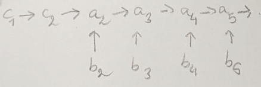

# comprendre le tri par fusion-insertion

on veut trier un tableau de n nombres.

algorithme en 5 étapes.

**étape 1** : faire des paires d'éléments.

**étape 2** : ordonner les 2 éléments qui composent chaque paire.

on dit que l'élément le plus grand d'une paire donnée est de type `a`, et l'autre de type `b`.

la notation `b -> a` signifie `b` < `a`. dans la paire d'indice `n`, on a : `b_n -> a_n`.

**étape 3** : trier les paires par ordre croissant selon les éléments de type `a`.

cela se fait par récurrence, selon le même algorithme. on va obtenir :


**étape 4** : initialiser l'insertion.

on dit qu'un élément de type `a` ou `b` devient de type `c` lorsqu'il est inséré dans la liste finale. la liste des `c` en question est donc triée à tout moment et se situe avant les paires (voir sur les schémas).

l'algorithme consiste à faire des série d'insertions d'éléments de type `b` dans la liste finale, ce qui au passage va aussi insérer les éléments de type `a` qui leur sont associés.

pour cette première série d'insertion, rien ne va changer à part la notation. en effet, on veut juste insérer `b1` (et automatiquement le `a1` qui lui est associé). or, `b1` est déjà bien placé, donc on ne fait rien.

à noter que pour insérer un élément dans cette liste vide de `c`, 0 comparaisons auront été nécessaires.

on obtient les 2 premiers `c`, qui sont les anciens `b1` et `a1` :



**étape 5** : continuer les séries d'insertions.

le nombre d'éléments de type `c` détermine la prochaine série d'insertions. en effet, il ne faut pas juste insérer les `b` dans l'ordre des paires. petit exemple pour comprendre cela :

## si on insère b2 puis b3

### pour b2

on veut insérer `b2` dans un tableau trié [`c1`, `c2`]. ça va nous couter au plus 2 comparaisons (une avec `c2`, et, si on a pas de chance, une autre avec `c1`). (voir annexe pour un rappel sur la recherche dichotomique).

on se retrouve avec une configuration :


### pour b3

on veut insérer `b3` dans un tableau trié [`c1`, `c2`, `c3`, `c4`].

comme on trie par dichotomie, on sait que ça va nous coûter au plus 3 comparaisons (une avec `c3`, une autre avec `c2` ou `c4`, et potentiellement, une 3e avec `c1`).

au final, si on insère `b2` avant `b3`, ça nous coûte, au pire, **5** comparaisons.

## si on insère b3 puis b2


on veut insérer `b3` dans un tableau trié [`c1`, `c2`]. donc, comme on l'a vu juste avant, ça va nous coûter, au plus, 2 comparaisons.

et là, miracle, lorsqu'on va vouloir insérer `b2`, on sera dans cette configuration :


donc on va vouloir insérer `b2` dans un tableau trié [`c1`, `c2`, `c3`], ce qui ne coûte toujours que 2 comparaisons, et non 3 (une avec `c2`, et une autre avec `c1` ou `c3`).

donc, si on insère `b3` avant `b2`, ça nous coûte, au pire, **4** comparaisons. c'est mieux que si on insère `b2` avant `b3` et ce sera encore plus marquant pour de grandes tailles de `c`.

## les prochaines séries d'insertion

la 2e série d'insertion a permis d'insérer 2 éléments de type `b` dans la liste finale (et automatiquement les 2 éléments de type `a` qui leur était associé), en utilisant, pour chaque insertion, le même nombre maximal de comparaisons.

on se retrouve dans cette configuration :


quel élément faut-il insérer ensuite ? encore une fois, cela dépend de la taille de `c`.

pour une taille de 6, il faut d'abord insérer `b5`, puis `b4`. ainsi, on aura, au pire, pour l'une et pour l'autre insertion, seulement 3 comparaisons à faire.

une fois `b4` et `b5` inséré, on est dans la configuration :


(changer `d` en `c`)

là, pour une taille de 10, la prochaine série consiste à insérer `b11`, puis `b10`, `b9`, `b8`, `b7`, et `b6` (et donc automatique les éléments de type `a` qui leur sont associés). ainsi, on aura, pour toutes ces insertions, au plus 4 comparaisons à faire.

## comprendre et trouver l'ordre des insertions

### généraliser la recherche dichotomique

on cherche le nombre de comparaisons nécessaires pour insérer une valeur b dans un tableau trié de n éléments.

on l'a vu, pour n = 2, c'est 2. pour n = 3, c'est 2 aussi. pour n = 4, 5, 6, 7, c'est 3. à partir de 8, c'est 4. à partir de 16, c'est 5.

on en déduit que, pour une taille n, c'est floor ( log2 (n) ) + 1.

### lien avec la suite de jacobsthal

pas vraiment besoin d'utiliser la taille de la liste c. on a juste besoin de retrouver la suite :

0, 1, 1, 3, 5, 11, 21, 43, 85, 171, 341, 683, 1365, ...

elle nous donne l'indice des éléments b qui initient une série d'insertion. d'où le fait qu'il faille d'abord insérer :
- b3 + tout ce qui lui est inférieur, donc b2
- b5, b4
- b11, b10, b9, b8, b7, b6
- b21, b20, ..., b12

# annexe : trouver l'indice d'insertion grâce à la recherche dichotomique

(lire https://fr.wikipedia.org/wiki/Recherche_dichotomique avant, pour comprendre le principe d'une recherche dichotomique.)

soit `T` = [`T[0]`, `T[1]`, `T[2]`, ..., `T[n - 1]`], un tableau **trié** de n nombres.

on veut insérer un nombre `b` dans T. pour cela, on veut savoir l'indice de `T` auquel insérer `b`.

il se trouve que cet indice n'est autre que le nombre d'éléments de `T` qui sont inférieurs à `b`.

on pourrait parcourir `T` et compter le nombre d'éléments qui sont inférieurs à `b`, mais cela reviendrait à faire jusqu'à n comparaisons si `b` doit être inséré à la fin de `T`, par exemple.

on peux faire mieux avec la recherche dichotomique, car `T` est trié, réduisant à log2(n) le nombre maximal de comparaisons.

c'est un algorithme récursif. appelons-le `recherche_indice`. il prend en argument le sous tableau de `T` des éléments compris entre les indices `i` (inclus) et `j` exclu, que je vais noter `T[i:j]`, et notre élément `b`.

- cas de base : `T[i:j]` est de taille 1.
  - si `T[i]` < `b`, alors on a trouvé l'indice où insérer : c'est `j`. ainsi, on va insérer `b` juste après `T[i]`. 
  - si `T[i]` > `b`, alors on a trouvé l'indice où insérer : c'est `i`. ainsi, on va insérer `b` juste avant `T[i]`. 
- pour un sous tableau `T[i:j]` de taille `j - i` > 1, on compare `b` à l'élément central de `T[i:j]`. appelons `c` l'indice de cet élément central. on l'obtient en faisant : `i + (j - i) / 2`.
  - si `b` < `T[c]`, on renvoie `recherche_indice(T[i:c], b)` 
  - si `b` > `T[c]`, on renvoie `recherche_indice(T[c + 1:j], b)`

## exemple simple

T = [2, 9, 13, 21]

```
recherche_indice(T[0:4], 8)
	taille de T[0:4] = 4 - 0 = 4
	c = 0 + 4 / 2 = 2
	T[2] = 13
	8 < 13 donc on renvoie recherche_indice(T[0:2], 8)
	recherche_indice(T[0:2], 8)
		taille de T[0:2] = 2 - 0 = 2
		c = 0 + 2 / 2 = 1
		T[1] = 9
		8 < 9 donc on renvoie recherche_indice(T[0:1], 8)
		recherche_indice(T[0:1], 8)
			taille de T[0:1] = 1
			(cas de base)
			T[0] = 2
			2 < 8 donc on renvoie 1

recherche_indice(T[0:4], 10)
	taille de T[0:4] = 4
	c = 2
	T[2] = 13
	10 < 13 donc on renvoie recherche_indice(T[0:2], 10)
	recherche_indice(T[0:2], 10)
		taille de T[]


```

   tableau de taille 1 car, pour un appel donné, il va se relancer sur un tableau  . pour prenons n = 4 pour comprendre.

au premier niveau, on lance l'algo sur T tout entier. la longueur du tableau est de 4, 4 / 2 = 2, donc on compare `b` à `a_2`. 

si `b` > `a2`, alors on sait qu'il faut l'insérer après `a_2`. on relance l'algo sur T de l'indice 2 + 1 à... 3


 tout entier. on prend l'indice du milieu de T, soit n / 2

et limiter ce nombre de  à  en utilisant une recherche dichotomique.

la  est possible sur un tableau trié.